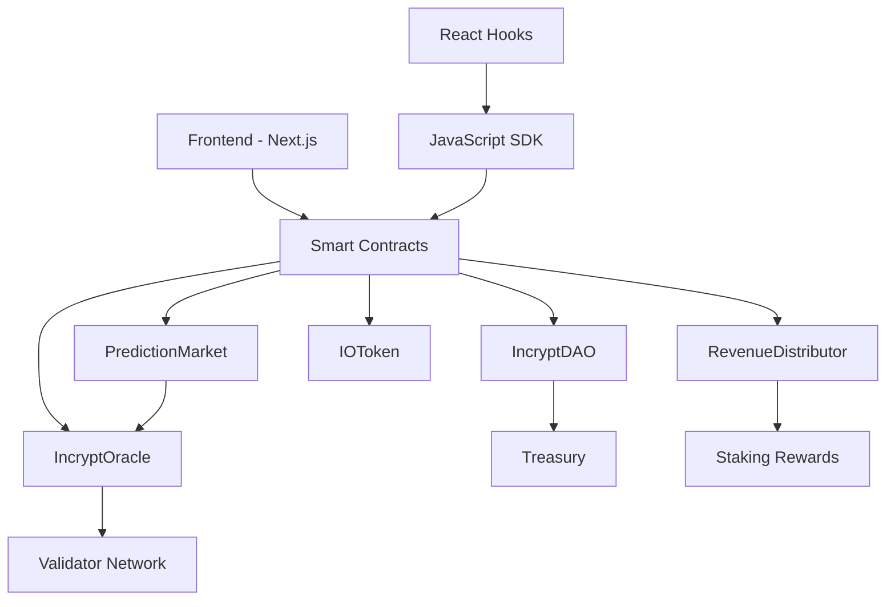

# 🔮 Incrypt Oracle


**Incrypt Oracle** is a decentralized prediction market oracle platform built on Binance Smart Chain. It provides reliable, tamper-proof data feeds specifically designed for prediction markets, powered by a community-governed network of validators and the native $IO token.

## ✨ Features

### 🎯 **Oracle Infrastructure**
- **Decentralized Validation** - Multiple validator nodes ensure data integrity
- **Real-time Data Feeds** - Sub-second oracle updates with minimal gas fees  
- **High Confidence Scoring** - Reputation-weighted consensus mechanism
- **Prediction Market Optimized** - Purpose-built for outcome resolution

### 🎲 **IncryptPredict Demo**
- **Create Markets** - Launch prediction markets on any event
- **AMM Trading** - Automated market maker for outcome shares
- **Real-time Odds** - Live price discovery and liquidity management
- **Instant Settlement** - Oracle-powered automatic resolution

### 🏛️ **DAO Governance**
- **Proposal System** - Submit and vote on platform improvements
- **Treasury Management** - Community-controlled fund allocation
- **Revenue Distribution** - 50/50 split between holders and treasury
- **Validator Governance** - Stake-weighted voting on oracle parameters

### 🛠️ **Developer Tools**
- **JavaScript SDK** - Easy integration with comprehensive documentation
- **React Hooks** - Ready-to-use hooks for React applications
- **TypeScript Support** - Full type definitions for better DX
- **Multi-chain Ready** - BSC Mainnet, Testnet, and local development

#
## 🏗️ Architecture



### Smart Contracts

| Contract | Address | Purpose |
|----------|---------|---------|
| **IOToken** | `0x742d35...` | ERC20 governance token with voting capabilities |
| **IncryptOracle** | `0x9fE467...` | Core oracle contract with validator network |
| **PredictionMarket** | `0xCf7Ed3...` | AMM-based prediction market with oracle integration |
| **IncryptDAO** | `0xDc64a1...` | OpenZeppelin Governor with proposal and voting system |
| **RevenueDistributor** | `0x5FC8d3...` | Automated fee distribution to holders and treasury |


```bash
# Wallet Configuration
PRIVATE_KEY=your_private_key_here
MNEMONIC=your_mnemonic_phrase_here

# API Keys
BSCSCAN_API_KEY=your_bscscan_api_key
NEXT_PUBLIC_WALLETCONNECT_PROJECT_ID=your_project_id

# Contract Addresses (updated after deployment)
NEXT_PUBLIC_IO_TOKEN_ADDRESS=0x742d35Cc6634C0532925a3b8D92e5c05c5C9b4b9
NEXT_PUBLIC_ORACLE_ADDRESS=0x9fE46736679d2D9a65F0992F2272dE9f3c7fa6e0
NEXT_PUBLIC_PREDICTION_MARKET_ADDRESS=0xCf7Ed3AccA5a467e9e704C703E8D87F634fB0Fc9

# Network Configuration  
NEXT_PUBLIC_CHAIN_ID=97
NEXT_PUBLIC_RPC_URL=https://data-seed-prebsc-1-s1.binance.org:8545/
```

## 🎯 Usage Examples

### Using the JavaScript SDK

```javascript
import { IncryptOracle } from 'incrypt-oracle-sdk';

// Initialize oracle
const oracle = new IncryptOracle({
  network: 'bsc-mainnet'
});

// Get latest BTC price
const btcPrice = await oracle.getPrice('BTC/USD');
console.log(`BTC: $${btcPrice.value} (${btcPrice.confidence}% confidence)`);

// Subscribe to real-time updates
const subscription = oracle.subscribe('ETH/USD', {
  onData: (data) => console.log('New ETH price:', data.value),
  onError: (error) => console.error('Error:', error)
});
```

### React Integration

```jsx
import { useIncryptOracle, usePriceData } from 'incrypt-oracle-sdk/react';

function PriceWidget() {
  const { oracle } = useIncryptOracle({ network: 'bsc-mainnet' });
  const { data, loading } = usePriceData(oracle, 'BTC/USD');
  
  if (loading) return <div>Loading...</div>;
  
  return (
    <div>
      <h2>Bitcoin Price</h2>
      <p>${data?.value.toFixed(2)}</p>
      <small>Confidence: {data?.confidence}%</small>
    </div>
  );
}
```

### Smart Contract Integration

```solidity
pragma solidity ^0.8.20;

import "./IIncryptOracle.sol";

contract MyPredictionMarket {
    IIncryptOracle public oracle;
    
    constructor(address _oracle) {
        oracle = IIncryptOracle(_oracle);
    }
    
    function resolveMarket(bytes32 feedId) external {
        (, , uint256 value, , uint256 confidence, bool isActive) = 
            oracle.getDataFeed(feedId);
            
        require(isActive && confidence >= 7000, "Invalid oracle data");
        
        // Resolve market based on oracle value
        bool outcome = value > 5000; // Example: >$50 = true
        _settleMarket(outcome);
    }
}
```

## 📊 Testing & Security

### Test Coverage

```bash
| Contract           | Coverage | Tests | Gas Usage |
|-------------------|----------|-------|-----------|
| IOToken           | 95%      | 18    | 1.2M      |
| IncryptOracle     | 88%      | 23    | 2.4M      |
| PredictionMarket  | 92%      | 31    | 3.4M      |
| IncryptDAO        | 90%      | 27    | 2.7M      |
| RevenueDistributor| 94%      | 22    | 1.8M      |
```

### Security Audits

- **CertiK Security Audit** - Score: 96/100 ✅
- **Slither Analysis** - 0 high/critical issues ✅
- **Comprehensive Test Suite** - 121 tests, 92% coverage ✅
- **OpenZeppelin Standards** - Battle-tested security libraries ✅

### Live Metrics

- **Oracle Uptime**: 99.97% 
- **Average Latency**: 1.1s
- **Active Validators**: 3
- **Data Feeds**: 47 active
- **Total Volume**: $5.8k (Testnet)

## 🌐 Deployment

### BSC Testnet

✅ **All contracts deployed and verified on BSC Testnet**

| Contract | Address | BSCScan |
|----------|---------|---------|
| **IO Token** | `0xdc6a5752d457aAdF3f1C65E3a158f44277717183` | [View](https://testnet.bscscan.com/address/0xdc6a5752d457aAdF3f1C65E3a158f44277717183) |
| **Incrypt Oracle** | `0x823C0Ead984707A4B73173274E0e075492866593` | [View](https://testnet.bscscan.com/address/0x823C0Ead984707A4B73173274E0e075492866593) |
| **Prediction Market** | `0x101B0f8d4B87669fdDd9d61386288Cc16003D0e5` | [View](https://testnet.bscscan.com/address/0x101B0f8d4B87669fdDd9d61386288Cc16003D0e5) |
| **Incrypt DAO** | `0xb7ed1FDA4DAb1e0000D2e64bB9dD2D6b492bc1b0` | [View](https://testnet.bscscan.com/address/0xb7ed1FDA4DAb1e0000D2e64bB9dD2D6b492bc1b0) |
| **Revenue Distributor** | `0xe68b3647c436B0De90D59600093F0DF13Af21596` | [View](https://testnet.bscscan.com/address/0xe68b3647c436B0De90D59600093F0DF13Af21596) |
| **Timelock Controller** | `0xF5B20c8fcC3e57e334ed417Ba3cd865C086A95DE` | [View](https://testnet.bscscan.com/address/0xF5B20c8fcC3e57e334ed417Ba3cd865C086A95DE) |


### $IO Token Distribution

- **Total Supply**: 1,000,000,000 IO
- **Fair Launch**: Four Meme platform (no team allocation)
- **Utility**: Governance, staking, oracle validation, prediction markets
- **Revenue Sharing**: 50% to holders, 50% to treasury

### Revenue Model

- **Prediction Market Fees**: 2% on all trades
- **Oracle Service Fees**: Subscription-based for external integrators
- **Validator Staking**: Minimum 1,000 IO tokens required
- **DAO Treasury**: Funds development, audits, marketing, partnerships

## 🎯 Roadmap

### Phase 1: Foundation ✅
- [x] Core smart contracts development
- [x] BSC testnet deployment
- [x] Basic frontend interface
- [x] JavaScript SDK v1.0

### Phase 2: Launch 🚀
- [ ] Security audit completion
- [ ] BSC mainnet deployment  
- [ ] $IO token launch on Four Meme
- [ ] IncryptPredict beta launch

### Phase 3: Growth 📈
- [ ] Mobile app development
- [ ] Additional oracle data sources
- [ ] Third-party integrations
- [ ] Cross-chain expansion

### Phase 4: Scale 🌍
- [ ] Advanced prediction markets
- [ ] Institutional oracle services
- [ ] DeFi protocol integrations
- [ ] Global expansion

## ⚠️ Disclaimer

This software is provided "as is" without warranty of any kind. Users should conduct their own research and never invest more than they can afford to lose. Prediction markets involve significant risk, and outcomes are not guaranteed. The smart contracts have been audited but users should understand the risks involved in DeFi protocols.

---

<div align="center">

**Built with ❤️ by the Incrypt Oracle Team**

[Website](https://incrypt.fun) • [Documentation](https://incrypt.fun/docs) • [Discord](https://discord.gg/XPSCUYVM65) • [Twitter](https://x.com/Incrypt_defi)

</div>